Summary
####################
This guide provides the steps, the sample app, and the automation scripts for a hands-on exploration of two of Volterra's use-cases: (a) multi-cloud networking between two Kubernetes clusters, and (b) deploying a distributed workload to the Volterra global network. 

If you're only interested in the multi-cloud networking piece, follow the pre-requisite AWS environment setup and part A: Connect K8s Clusters. If you'd like to explore deployment of a workload to Volterra, and the secure connectivity of the workload to AWS, make sure to check out Part B: Deploy a distributed workload as well.

Disclaimers
###################

The guide and the included Terraform scripts make it easy to get moving quickly by creating a realistic 'starter' environment in Amazon AWS (Amazon EKS managed Kubernetes service, networking, etc). Please recognize that you are solely responsible for the resources that you create and those created by the scripts; so make sure to review the scripts and run them only at your own discretion, given the IAM permissions required. Finally, we recommend cleaning up by removing any resources you no longer need once you've completed this guide.

==================================================

.. contents:: Table of Contents

Scenario Overview
####################

In this guide we will use a fictitious e-Commerce application scenario: a BuyTime Online store looking to improve its front-end application user experience by implementing a globally-distributed Find-a-Store service. We will get familiar (and hands-on) with the following Volterra services: VoltConsole, VoltMesh, and Volterra Global Network by F5. These are used to securely connect between Kubernetes deployments, as well as enable a distributed app services running at the geographically dispersed Regional Edge (RE) locations.

In the AWS Environment Setup section we will use the included Terraform scripts to create the required EKS infrastructure and the "initial" state app deployment. Then we'll use VoltConsole to connect two Kubernetes (K8s) clusters: an *AWS EKS cluster* and a *virtual K8s (vK8s)* running in Volterra. The vK8s is used in place of any other K8s cluster, which could be a standalone cluster or a managed K8s on any other cloud provider. Lastly, we will deploy a container-based distributed workload to the Volterra Global Network to improve the performance of the Find-a-Store service at the customer edge. 

Let's get started!

Pre-Requisites
###############

- AWS Account https://aws.amazon.com/
- AWS Cli https://docs.aws.amazon.com/cli/latest/userguide/install-cliv2.html
- Terraform https://learn.hashicorp.com/tutorials/terraform/install-cli
- Kubectl https://kubernetes.io/docs/tasks/tools/
- Volterra account  https://volterra.io

AWS Environment Setup  
############################### 

The initial environment in AWS contains the "initial" deployment of the BuyTime Online *without* the Find-a-Service function, running on the AWS EKS managed K8s cluster. This cluster will be subsequently connected to the vK8s deployment of the Find-a-Store service on the Regional Edge (RE), providing secure networking from the distributed Find-a-Store service to the MySQL running on EKS to periodically pull US Zip code & store coordinate data from a central location. 

1. AWS CLI
*************************** 

Sign in the AWS Management Console and follow a few steps below to create a new user with IAM policies required for the guide. 

In the guide we will use **us-west-1** AWS region. If you would like to use another, you can change the region setting in the **/terraform/variables.tf** file and in the step 1.16.

`1.1` Type in **IAM** in the search field to find and proceed to the **IAM - Manage access to AWS resources**.  

.. figure:: _figures/aws_cli_config_1.png

`1.2` In the navigation pane on the left, choose **Policies**. Then choose **Create Policy**.

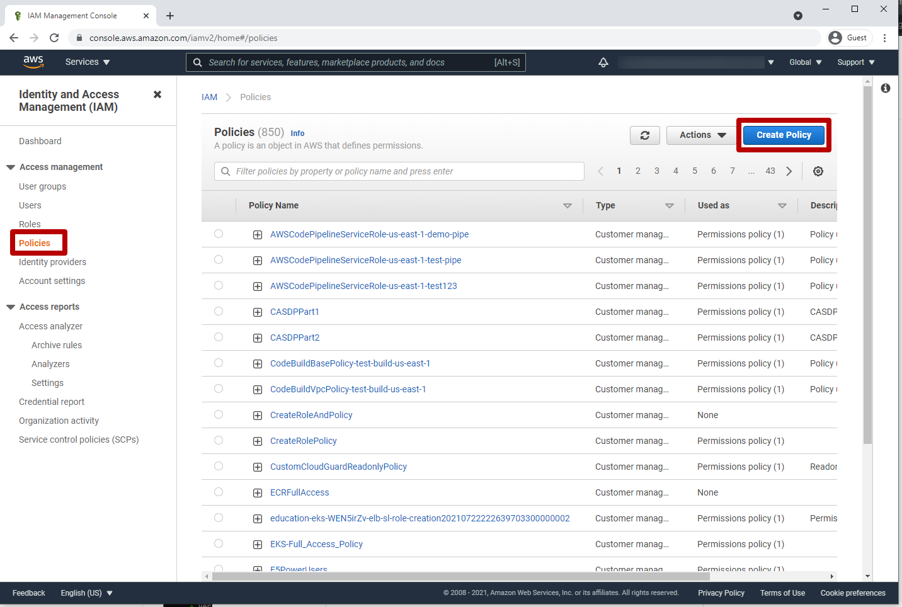

`1.3` Choose the **JSON** tab. Copy the JSON policy document `here </IAM-policy.json>`_  and paste it into the open window. Then click **Next: Tags**.

.. figure:: _figures/aws_cli_config_1_3.png

`1.4` This page is optional. You can add metadata to the policy by attaching tags as key-value pairs. Let's skip this option and proceed by clicking **Next: Review**. 

.. figure:: _figures/aws_cli_config_1_4.png

`1.5` On the **Review policy** page, type a **Name** (let's use **DemoEKSClusterPolicy** for this guide). Description field is optional, so let's skip it. In the **Summary** section, you can see the permissions that are granted by your policy. Click **Create policy** when you are ready to save the policy.

.. figure:: _figures/aws_cli_config_1_5.png

`1.6` Let's now create an IAM user. In the navigation pane, choose **Users**. Then select **Add users**. This will open the page with user details. 

.. figure:: _figures/aws_cli_config_3.png

`1.7` Enter the user name **cli-user** for the new user. Note that this is the sign-in name for AWS Cli. After that select the type of access the user will have. For this flow, let's select **Programmatic access**. This creates an **Access key ID** and **Secret access key**. You can view or download the access keys when you get to the Final page. Move on to set up permissions by clicking **Next: Permissions**.

.. figure:: _figures/aws_cli_config_4.png

`1.8` There are three permission options available, but for this flow let's select **Attach existing policies directly**. This will show a list of the AWS managed and customer managed policies in your account. Paste **DemoEKSClusterPolicy** to the Search Box and tick it to apply to the new user. Click **Next: Tags** to move on.

.. figure:: _figures/aws_cli_config_5.png

`1.9` Tag setting is optional, so let's move on by clicking **Next: Review**. 

.. figure:: _figures/aws_cli_config_6.png

`1.10` This page shows all of the choices you made up to this point. When you are ready to proceed, choose **Create user**.

.. figure:: _figures/aws_cli_config_7.png

`1.11` To view the users' access keys (**Access key ID** and **Secret access key**), choose **Show** next to each password and access key. Copy or save the access key. Click **Close** to proceed. 

.. figure:: _figures/aws_cli_config_8.png

Note that you will not have access to the secret key again after this step.

`1.12` Now move on to CLI and run the **aws configure** command, which will set up the AWS CLI installation, and we will be able to use the AWS API under account we've created.

.. figure:: _figures/aws_cli_config_9.png

`1.13` After successful setting up AWS CLI installation, we will need to run the **terraform init** command, which will initialize a working directory containing Terraform configuration files. 

.. figure:: _figures/eks_setup_1.png

`1.14` After we prepared the current working directory for use with Terraform, let's run the **terraform plan** command. This will create an execution plan. 

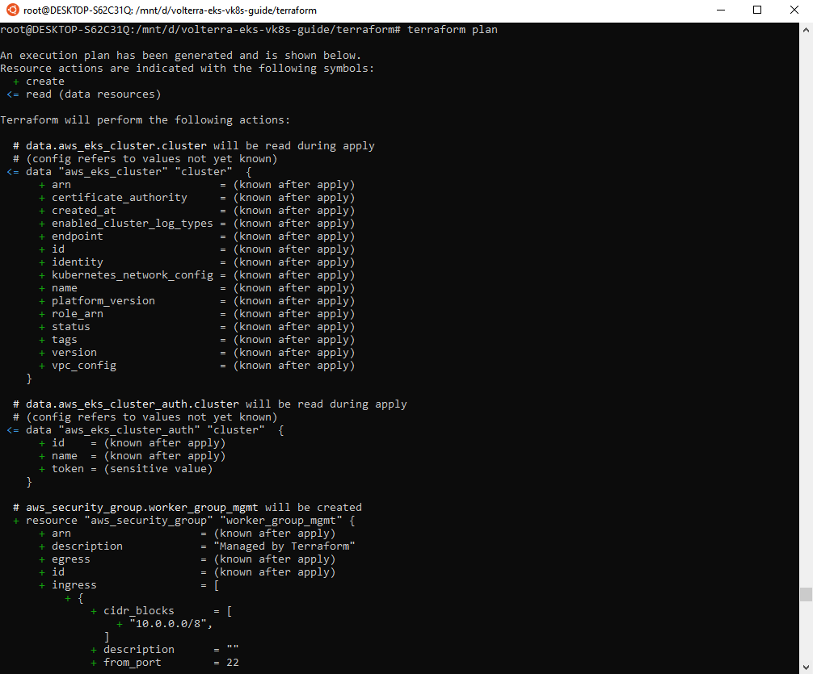

`1.15` Run the **terraform apply** command that executes the actions proposed in the terraform plan created a step above.

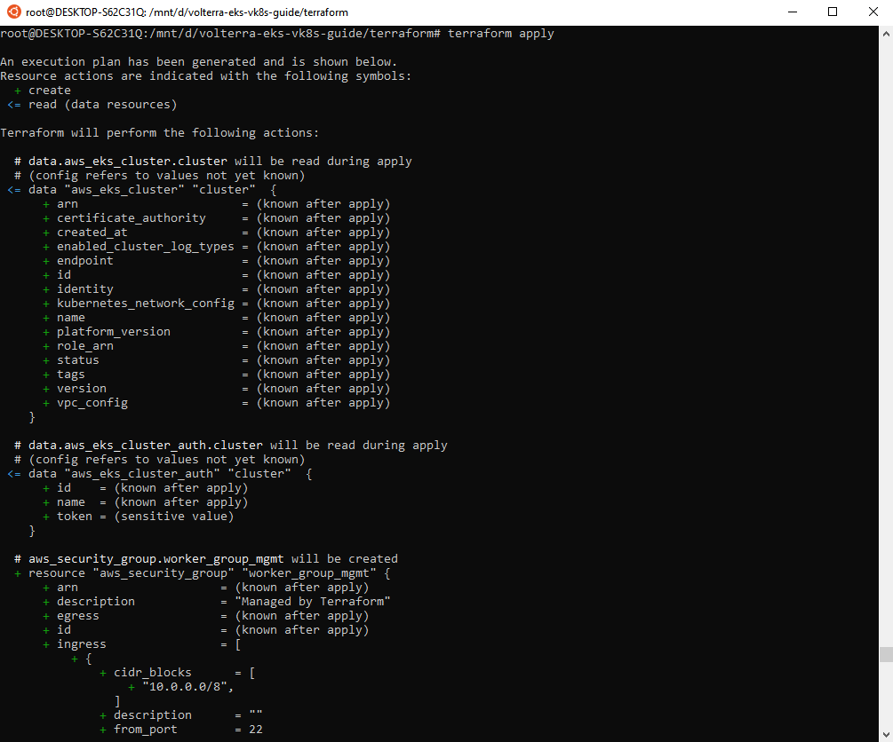

`1.16` After the terraform plan has been executed, let's configure kubectl so that we could connect to an Amazon EKS cluster. Run the following command: 

**aws eks update-kubeconfig --region $(terraform output -raw region) --name $(terraform output -raw cluster_name)**

.. figure:: _figures/eks_setup_4.png

`1.17` One step left - deploying the BuyTime Online resources to AWS EKS cluster. Go to the **k8s-deployments** directory and run the following command: 

**kubectl apply -f eks-deployment.yaml**

.. figure:: _figures/eks_setup_5.png

`1.18` Let's now see how the BuyTime Online deployment looks like on the EKS cluster. For that we need to get a LoadBalancer endpoint name. Run the **kubectl get services** command and copy buytime-external FQDN.

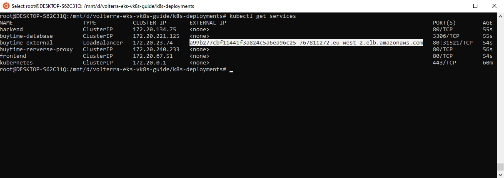

`1.19` Open FQDN in the browser. It may take some time to create resources.

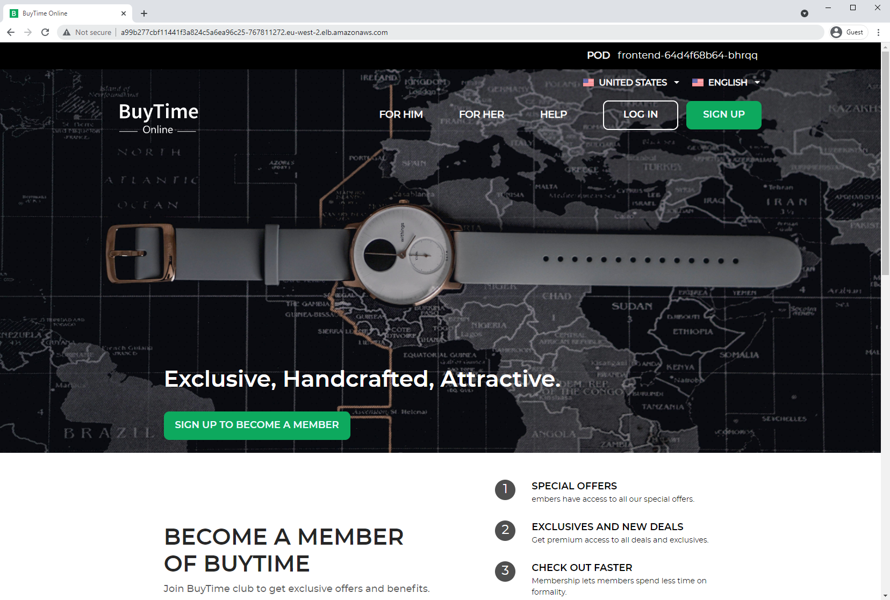

A. Connect K8s Clusters with Volterra
####################################### 

In this section we will use Volterra to make a connection between an AWS EKS cluster and virtual K8s running in Volterra (any other Kubernetes can be used instead, for example a managed K8s deployed on a different cloud provider). This provides a single point of deployment and management of container-based workloads to multiple K8s clusters potentially running in multiple clouds.

First, we'll need to generate a site token, which is used among a few other things to deploy and configure a K8s cluster as a Volterra Site. Then we'll update the manifest with the generated token, and, finally, we'll deploy it.

1. Create token
***************

`1.1` Log in the VoltConsole and go to the **System** namespace.  Then navigate to **Site Management** in the configuration menu, and select **Site Tokens** from the options pane.

.. figure:: _figures/connect_eks_cluster_1.png

`1.2` Click **Add site token** to open the form and create a new token.

.. figure:: _figures/connect_eks_cluster_2.png

`1.3` Then enter the site name. Description field is optional. Click **Add site token** button at the bottom of the form. 

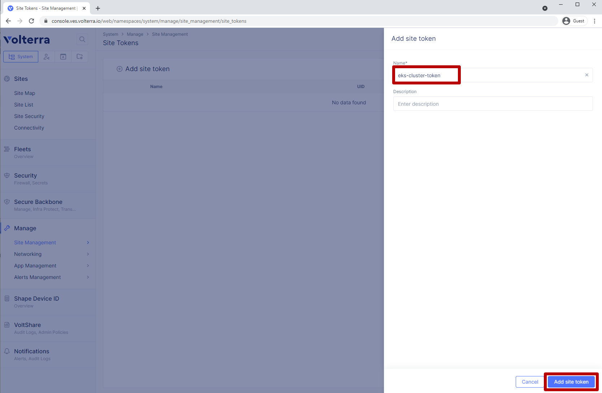

`1.4` Copy the token UID to use it for the manifest file in the next step.

.. figure:: _figures/connect_eks_cluster_4.png

2. Update manifest
*******************

Open the kubernetes deployment file located at **./k8s-deployments/volterra-k8s-manifest.yaml**. Replace the token generated in the previous step with **<token>** at **line 102** like on the screen below and save the file. The edited manifest will later be applied to spawn a Volterra Mesh on the EKS cluster. The original manifest template file can be found here:  `Manifest Template <https://gitlab.com/volterra.io/volterra-ce/-/blob/master/k8s/ce_k8s.yml>`_. 

.. figure:: _figures/connect_eks_cluster_5.png

3. Deploy manifest
*******************

Go to the **./k8s-deployments** directory, open the console and run the following command: **kubectl apply –f volterra-k8s-manifest.yaml**. This deploys the site using the created manifest file.

.. figure:: _figures/connect_eks_cluster_6.png

4. Accept registration
*************************

The Site we just configured will show up as a new registration request in the VoltConsole. We now need to approve the registration request for the site.

`4.1` Go back to the VoltConsole, the **System** tab. Navigate to the **Site Management** menu option to accept the pending registration. Select **Registrations** from the options pane. You will see your site in the displayed list. 

.. figure:: _figures/connect_eks_cluster_7.png

`4.2` Click the tick to load the **Registration Acceptance** form.

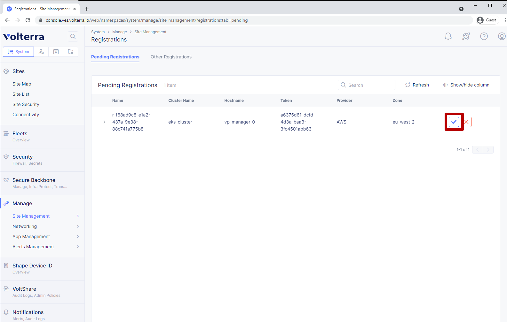

`4.3` Click the **Save and Exit** button to save the registration.

.. figure:: _figures/connect_eks_cluster_9.png

5. Check status
*******************

We have now configured our Site, so let's see its status, including health score. Go to the **Site List** tab and you’ll see the dashboard of your site. In the screenshot below, we can see that the site is up and running, with 100% health score. 

.. figure:: _figures/connect_eks_cluster_10.png

**Note**: It may take a few minutes for the health and connectivity status to get updated in the portal.

B. Deploy a distributed workload to the Volterra Global Network Regional Edge (RE)
#####################################################################################

Volterra provides mechanism to easily deploy distributed app services to Regional Edge (RE) locations by using the Volterra Global Network. First, in Step (1) we will create a virtual K8s (vK8s) spanning multiple geographic locations, and then in the Step (2) deploy a Find-a-Store app service and an updated BuyTime Online front-end closer to the RE locations, which will improve app performance by delivering the applications closer to geographically-dispersed end users. 

1. Create a vK8S Cluster
######################### 

Virtual Kubernetes (vK8s) clusters are fully-functional Kubernetes deployments that can span multiple geographic regions, clouds, and even on-prem environments. Let's now follow a few steps below to create a vK8s object in VoltConsole, associate with a virtual site that groups Volterra sites, download kubeconfig of the created vK8s and test connectivity.

1.1. Create cluster
*******************

`a)` Select **Applications** tab and then navigate to **Virtual K8s** from the configuration menu. Click **Add virtual K8s** to create a vK8s object.

.. figure:: _figures/create_vk8s_1.png

`b)` Let's now give the vK8s a name and then move on to **Select Vsite Ref**: the virtual-site reference of locations on the Volterra network where vK8s will be instantiated. We will use the default virtual-site for our vK8s.

.. figure:: _figures/create_vk8s_2.png

`c)` Check the box just next to **ves-io-all-res** to associate the virtual site that selects all Volterra network cloud sites, and click **Select Vsite Ref**.

.. figure:: _figures/create_vk8s_3.png

`d)` Continue to apply the virtual site to the vK8s configuration. Click **Save and Exit** to complete creating the vK8s clusters in all Volterra Regional Edge (RE) sites.

.. figure:: _figures/create_vk8s_4.png

The process of creating a vK8s cluster takes just a minute, and after that you will be all set to deploy and distribute app workloads onto this new infrastructure.

1.2. Download Kubeconfig
*************************

We will now need a kubeconfig file for our cluster. Kubeconfig stores information about clusters, users, namespaces, and authentication mechanisms. We will download the Kubeconfig entering the certificate expiry date when prompted. 

`a)` Open the dropdown menu by clicking three dots and start downloading Kubeconfig. 

.. figure:: _figures/create_vk8s_5.png

`b)` Open the calendar and select the expiry date. 

.. figure:: _figures/create_vk8s_6.png

`c)` Click **Download credential** to start the download.

.. figure:: _figures/create_vk8s_7.png

`d)` As you can see, Kubeconfig is downloaded. 

.. figure:: _figures/create_vk8s_8.png

`e)` Copy the downloaded Kubeconfig into the **k8s-deployments** folder.

.. figure:: _figures/create_vk8s_9.png

1.3. Check connection
**********************

Open CLI, and run the following command **kubectl --kubeconfig ./ves_default_vk8s.yaml cluster-info** to test if the created vK8s cluster is connected. If it's successfully accomplished, the output will show that it's running at Volterra.  

.. figure:: _figures/create_vk8s_10.png

2. Deploy resources to Volterra Edge
##################################### 

After vK8s cluster has been created and tested, we can target our Find-a-Store service and an updated version of the BuyTime front-end to the geographically distributed Regional Edge (RE) locations. The Find-a-Store service will use VoltMesh to securely connect back to the deployment on AWS VPC in order to retrieve store location and US ZIP code & geolocation data. 

We'll create internal TCP and public HTTP load balancers, connecting Volterra with EKS cluster (with app's backend), and Volterra with the internet, respectively. Then we will test if the resources are successfully deployed to Volterra Edge and available. 

2.1. Deploy resources
**********************

Using Kubeconfig, we will now deploy our app to Volterra Edge moving there its front-end and Find-a-Store service. Open CLI and run the following command: 

**kubectl --kubeconfig ./ves_default_vk8s.yaml apply -f vk8s-deployment.yaml**

The output will show the services created. 

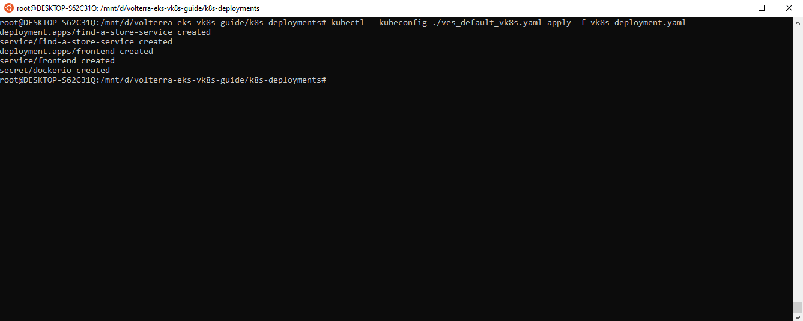

2.2. Create internal load balancer
************************************

Let's now create an internal TCP load balancer to connect Volterra with k8s cluster (where the app's backend is), then add and configure an origin pool. Origin pools consist of endpoints and clusters, as well as routes and advertise policies that are required to make the application available to the internet. 

`a)` In the **Application** tab, navigate to **Load Balancers** and then select **TCP Load Balancers** in the options. Then click **Add TCP Load Balancer** to open the load balancer creation form.

.. figure:: _figures/tcplb_mysql_1.png

`b)` Enter a name for the TCP load balancer in the Metadata section, and domain that will be matched to this balancer. A domain can be delegated to Volterra, so that Domain Name Service (DNS) entries can be created quickly in order to deploy and route traffic to our workload within seconds. For this flow, let's use **buytime-database.internal** domain. 

Then fill in listen port **3306** for the TCP proxy, and move on to creating origin pool that will be used for this load balancer by clicking **Configure** origin pools.

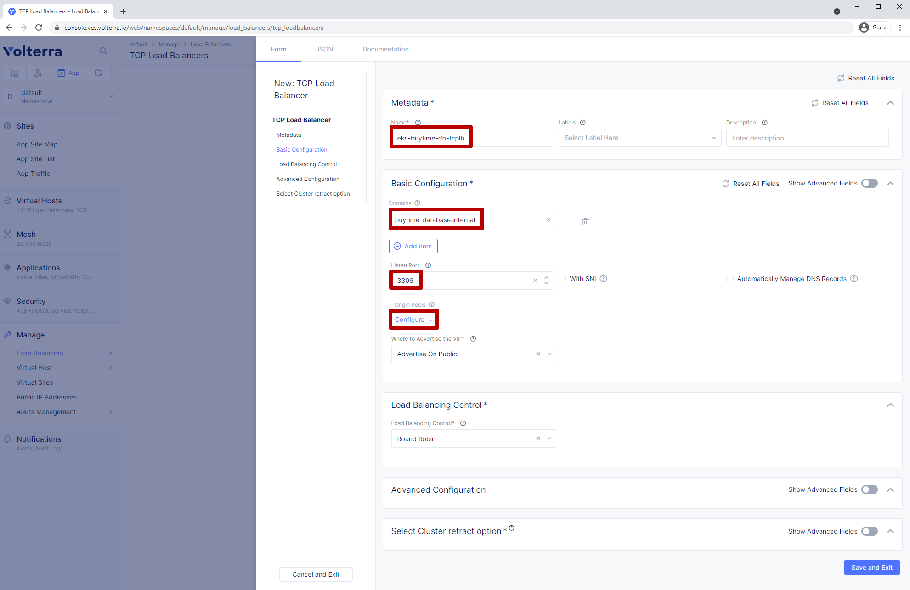

`c)` The origin pools are a mechanism to configure a set of endpoints grouped together into a resource pool that is used in the load balancer configuration. 

Let's create a new Origin Pool, which will be used in our load balancer by clicking **Add item**.

.. figure:: _figures/tcplb_mysql_3.png

`d)` Click **Create new origin pool** to open the origin pool creation form. 

.. figure:: _figures/tcplb_mysql_4.png

`e)` Enter a unique name for the origin pool, and then select **K8s Service Name of Origin Server on given Sites** as the type of origin server. Note that we will need to indicate the Origin Server **service name**, which follows the format of **servicename.namespace**. For this flow, use the namespace in which you deployed application in EKS cluster. Let's specify **buytime-database.<your-eks-ns>**.

After that select site reference to site object **eks-cluster**. This specifies where the origin server is located. 

Select **Outside Network** on the site and enter the port **3306** where endpoint service will be available. Click **Continue** to move on.

.. figure:: _figures/tcplb_mysql_5.png

`f)` Click **Apply** to apply the configuration of origin pool to the load balancer. This will return to the load balancer configuration form.

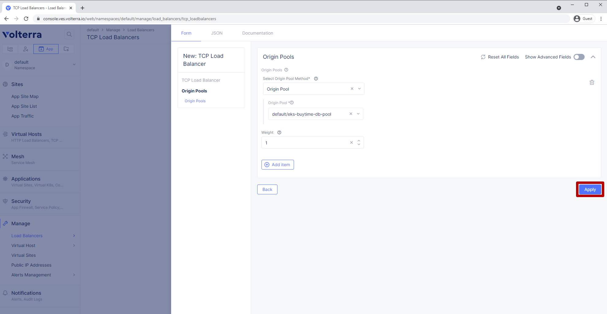

`g)` Let's configure the method to advertise VIP. Select **Advertise Custom** on specific sites which will advertise the VIP on specific sites, not on public network with default VIP. Then click **Configure**. 

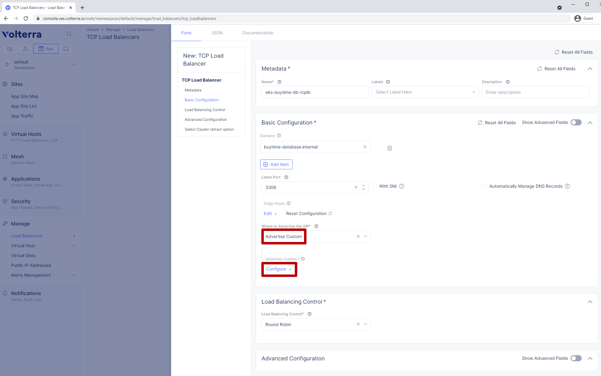

`h)` Select **Virtual Site** to advertise load balancer on a virtual site with the given network. Then select **vK8s Service Network** as network type to be used on site and move on to selecting reference to virtual site object - **shared/ves-io-all-res** covering all regional edge sites across Volterra ADN.  

**Apply** custom advertise VIP configuration.

.. figure:: _figures/tcplb_mysql_8.png

`i)` Finish creating the load balancer by clicking **Save and Exit**.

.. figure:: _figures/tcplb_mysql_9.png

Great! The internal TCP load balancer is now configured and created, and Volterra is connected with our EKS cluster with app's backend. Let's move on to creating public load balancer. 

2.3. Create public load balancer
**********************************

We will use Volterra HTTP Load Balancer as a Reverse Proxy to route traffic to resources located on Volterra vk8s and EKS based on the URI prefix. Let's follow the steps below to create load balancer for our app, an origin pool for **frontend**, and add routes for the load balancer - **backend** and **find-a-store-service**.

`a)` In the **Application** tab, navigate to **Load Balancers** and then select **HTTP Load Balancers** in the options. Then click **Add HTTP Load Balancer** to open the load balancer creation form.

.. figure:: _figures/httplb_1.png

`b)` First, enter the load balancer name. Then provide a domain name for our workload: a domain can be delegated to Volterra, so that Domain Name Service (DNS) entries can be created quickly in order to deploy and route traffic to our workload within seconds. Let’s use **buytime.example.com** as an example. Finally, move on to creating an origin pool that will be used for this load balancer by clicking **Configure**.

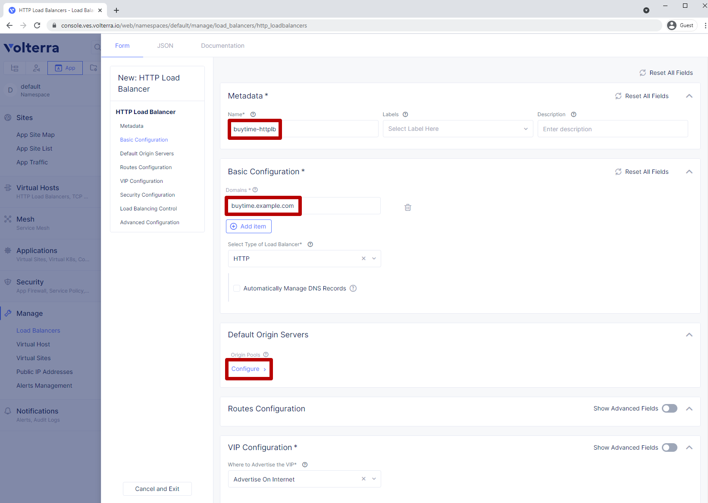

`c)` The origin pools are a mechanism to configure a set of endpoints grouped together into a resource pool that is used in the load balancer configuration. 

Let's create a new Origin Pool, which will be used in our load balancer by clicking **Add item**.

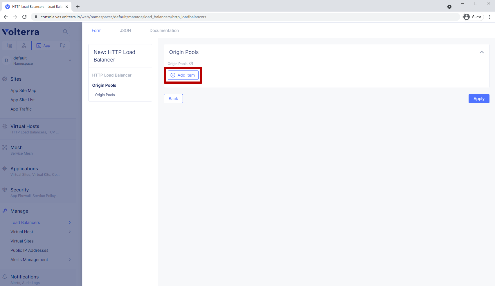

`d)` Click **Create new origin pool** to open the origin pool creation form. 

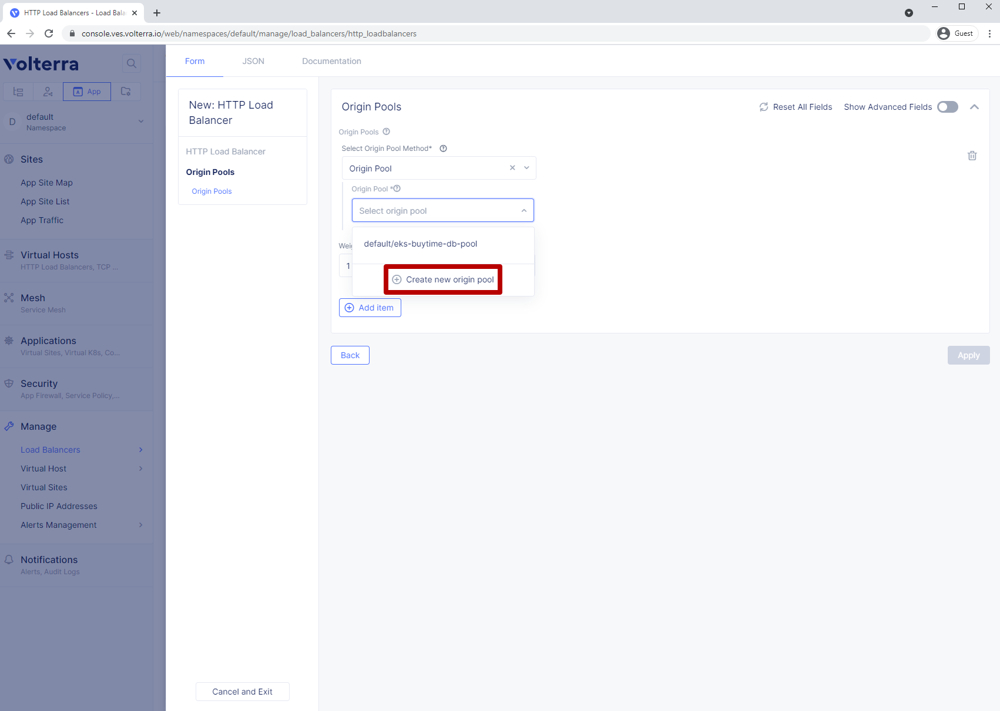

`e)` Enter a unique name for the origin pool, and then select **K8s Service Name of Origin Server on given Sites** as the type of origin server. Note that we will need to indicate the Origin Server **service name**, which follows the format of **servicename.namespace**. For this flow, use the namespace in which you deployed the vk8s cluster. Let's specify **frontend.<your-vk8s-ns>**.

After that select site **Virtual Site** as site where the origin server will be located. Specify reference to the virtual site object - **shared/ves-io-all-res** which includes all Regional Edge Sites across Volterra. After that, select **vK8s Networks on Site** as network, which means that origin server is on vK8s network on the site. And then enter the port **80** where endpoint service will be available. Click **Continue** to move on. 

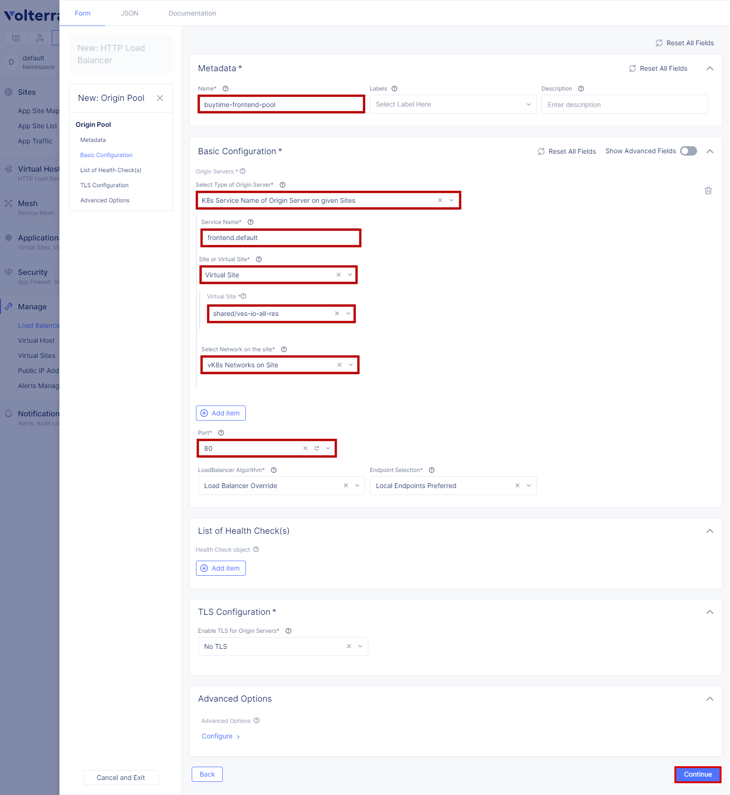

`f)` Click **Apply** to apply the configuration of origin pool to the load balancer. This will return to the load balancer configuration form.

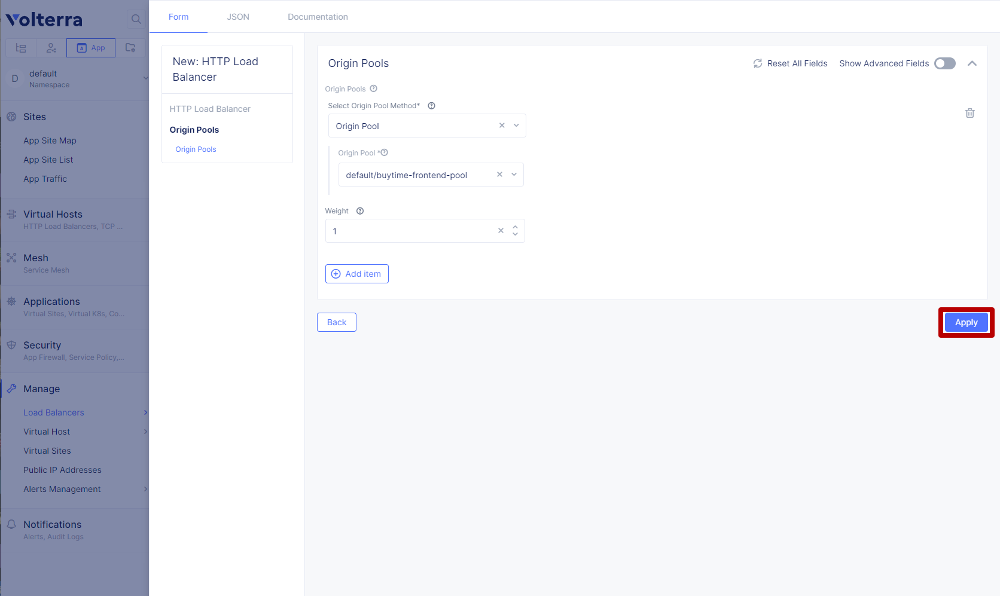

`g)` Enable **Show Advanced Fields** to configure routes for the load balancer. Click **Configure** to move on.

.. figure:: _figures/httplb_6.png

`h)` Let's add a route for the load balancer by clicking **Add item**.

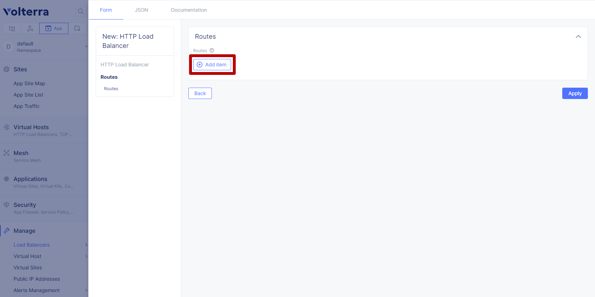

`i)` Select **ANY** HTTP Method for the route and specify **/api/v1** path prefix. Then click **Configure** to add origin pools for the route.

.. figure:: _figures/httplb_8.png

`j)` Click **Add item** to add an origin pool for the route.

.. figure:: _figures/httplb_9.png

`k)` Click **Create new origin pool** to open the origin pool creation form. 

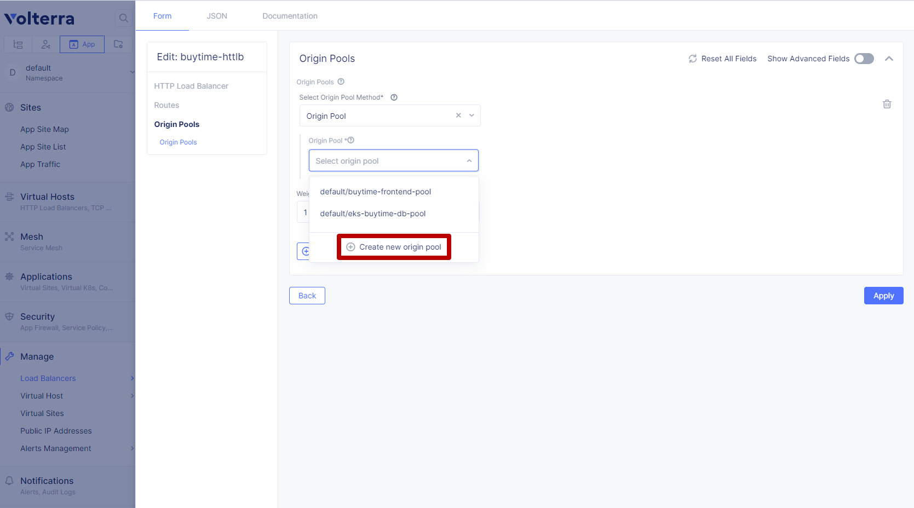

`l)` Enter a unique name for the origin pool, and then select **K8s Service Name of Origin Server on given Sites** as the type of origin server. Note that we will need to indicate the Origin Server **service name**, which follows the format of **servicename.namespace**. For this flow, use the namespace in which you deployed application in GKE cluster. Let's specify **backend.<your-eks-ns>**.

After that select **Site** as site where the origin server will be located. Specify site reference to site object **eks-cluster**. This specifies where the origin server is located. 

Select **Outside Network** on the site and enter the port **80** where endpoint service will be available. Click **Continue** to move on.

.. figure:: _figures/httplb_11.png

`m)` Click **Apply** to apply the configuration of route origin pool. This will return to the route configuration form.

.. figure:: _figures/httplb_12.png

`n)` Click **Add item** to configure the second route for the load balancer.

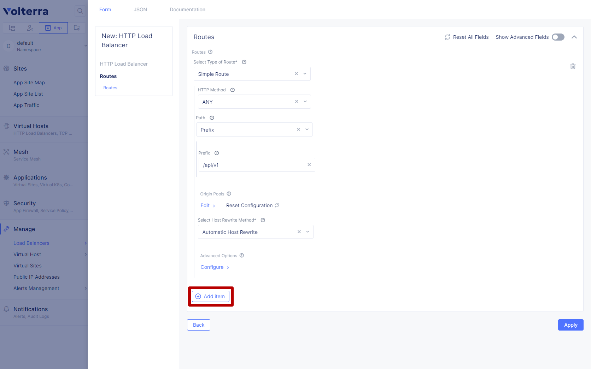

`o)` Select **ANY** HTTP Method for the route and specify **/api/v2** path prefix. Then click **Configure** to add origin pools for the route.

.. figure:: _figures/httplb_14.png

`p)` Click **Add item** to add an origin pool for the route.

.. figure:: _figures/httplb_15.png

`q)` Click **Create new origin pool** to open the origin pool creation form. 

.. figure:: _figures/httplb_16.png

`r)` Enter a unique name for the origin pool, and then select **K8s Service Name of Origin Server on given Sites** as the type of origin server. Note that we will need to indicate the Origin Server **service name**, which follows the format of **servicename.namespace**. For this flow, use the namespace in which you deployed the vk8s cluster. Let's specify **find-a-store-service.<your-vk8s-ns>**.

After that select site **Virtual Site** as site where the origin server will be located. Specify reference to the virtual site object - **shared/ves-io-all-res** which includes all Regional Edge Sites across Volterra. After that, select **vK8s Networks on Site** as network, which means that origin server is on vK8s network on the site. And then enter the port **80** where endpoint service will be available. Click **Continue** to move on. 

.. figure:: _figures/httplb_17.png

`s)` Click **Apply** to apply the configuration of route origin pool. This will return to the route configuration form.

.. figure:: _figures/httplb_18.png

`t)` Click **Apply** to apply the configuration of routes to the load balancer. This will return to the load balancer configuration form.

.. figure:: _figures/httplb_19.png

`u)` Finish creating the load balancer by clicking **Save and Exit**.

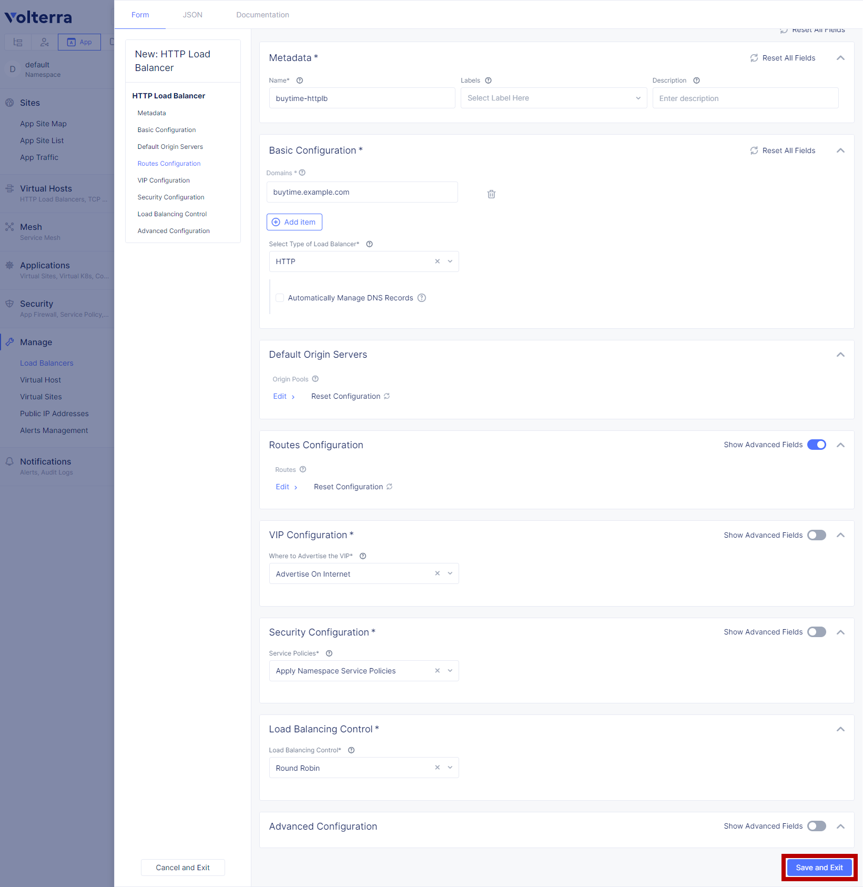

`v)` Let's now copy the generated CNAME for our HTTP load balancer to see if the app, whose frontend and Find-a-Store service are located in Volterra Edge, works.

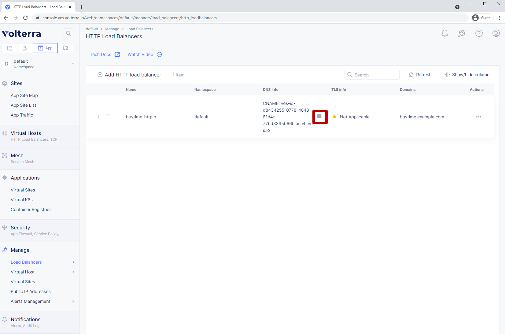

Validating distributed app deployment
######################################

Open any browser and paste the copied CNAME. You will see BuyTime front-end with the Find-a-Store service, which serves geographically-dispersed user base. The  Regional Edge deployment of the BuyTime closest to the user will respond to requests and perform nearest store calculations at the customer edge. Volterra VoltMesh creates the networking to securely connect the Find-a-Store services to the one central managed K8s deployment in AWS to periodically pull data from DataBase.

Let's give it a shot, by trying some US zip codes: 19001 and 98007.

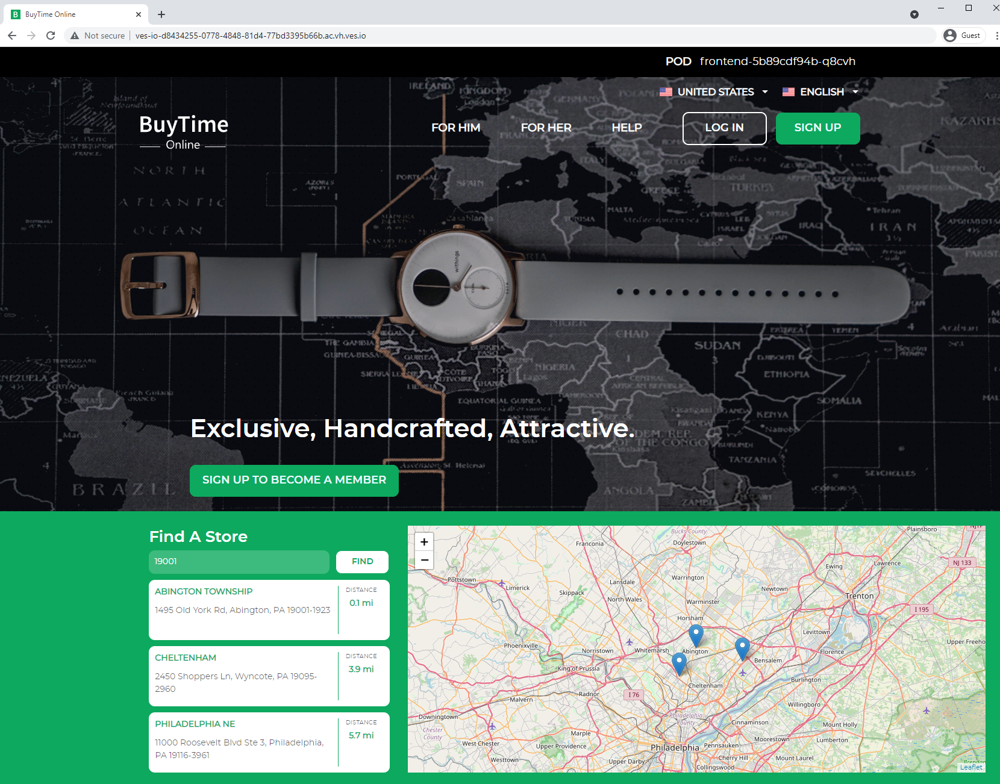

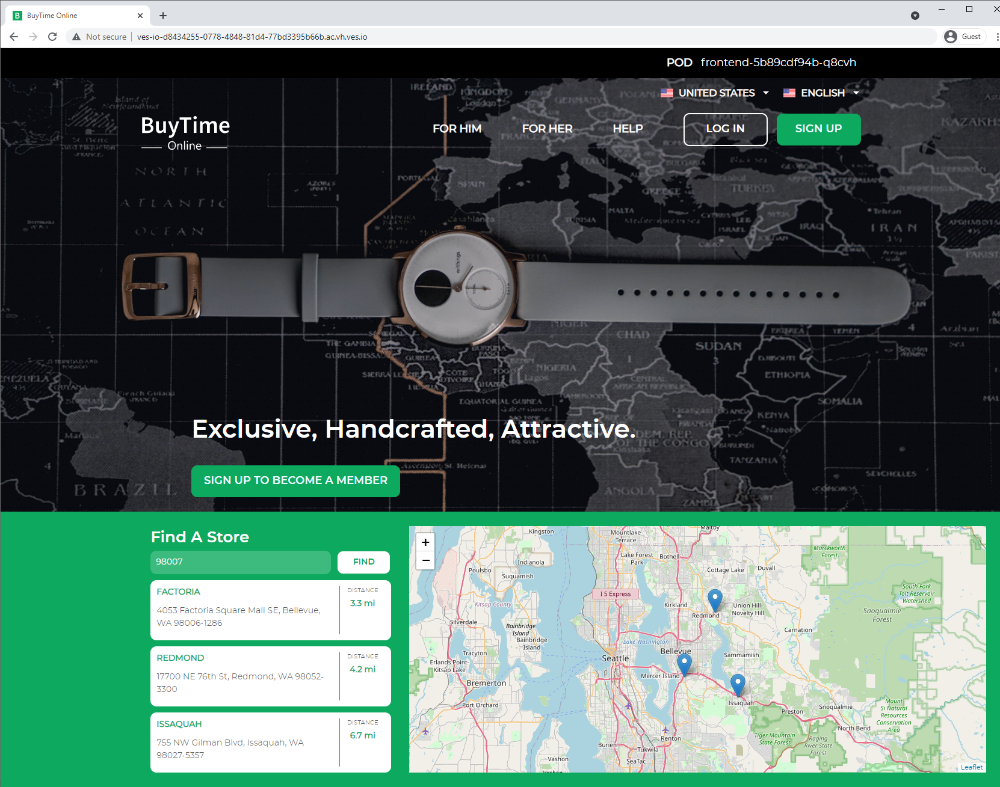

Congratulations, you used Volterra to connect two K8s clusters, deploy a distributed app service to the customer edge, and securely connect those deployments back to the app backend on AWS! 

Now you're ready to use Volterra with your own apps & workloads!
